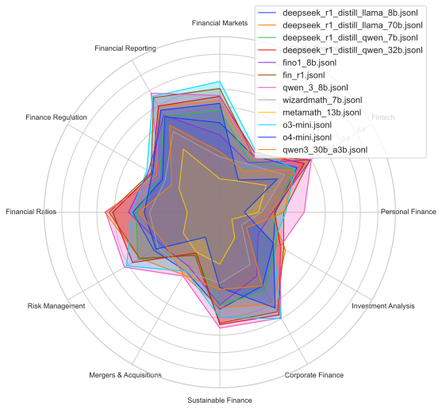

<p align="center">
  
</p>

<h1 align="center">FinChain</h1>
<p align="center"><em>A Symbolic Benchmark for Verifiable Chain-of-Thought
Financial Reasoning</em></p>

---

## 🔍 Overview

**FinChain** is the first benchmark designed for **verifiable chain-of-thought (CoT) financial reasoning**. It evaluates large language models on symbolic, multi-step problem-solving tasks grounded in financial equations. Built from scratch using a fine-grained financial taxonomy, FinChain enables step-level supervision and robust diagnostic evaluation.

> 📄 Paper: *FinChain: A Symbolic Benchmark for Verifiable Chain-of-Thought Financial Reasoning* (EMNLP 2025 submission)

## 📚 Key Features

- **54 topics** across **12 financial domains**
- **5 symbolic templates per topic** (2 easy, 2 intermediate, 1 advanced)
- **Executable Python traces** for step-level answer verification
- **ChainEval**, a custom metric for evaluating both final answers and intermediate steps

## 🧠 Example Template

<p align="center">
  
</p>

This example shows a symbolic template for Compound Interest:
- Parameterized with named variables (e.g., `principal`, `rate`, `time`)
- Includes both natural language and step-by-step symbolic solution
- Fully executable and verifiable

## 🗂️ Dataset Structure

```
FinChain-Reasoning/
├── chaineval/            # LangChain evaluation scripts
├── data/
│   └── templates/        # Symbolic prompt templates for 54 financial topics
│   └── testset/          # Synthetic testset containing template instances
├── eval/                 # ChainEval evaluation scripts
├── human_eval/           # Human evaluations
├── modles/               # Template generation scripts per model
├── performance_charts/   # Various performance charts
├── human_eval/           # Human evaluations
├── results/              # Evaluation results (per model)
└── README.md
```

Each instance includes:
- A financial problem generated from symbolic templates
- Gold reasoning trace with intermediate variables and calculations
- Executable code for ground-truth generation and verification

## 🧭 Taxonomy of Domains and Topics

FinChain covers 54 financial topics across 12 domains:

<p align="center">
  
</p>

Domains include:
- Corporate Finance
- Investment Analysis
- Personal Finance
- Financial Ratios
- Risk Management
- Sustainable Finance
- Mergers & Acquisitions
- Financial Markets
- Fintech
- Crypto Finance
- Financial Reporting
- Finance Regulation

## 🧪 ChainEval Metric

FinChain introduces **ChainEval**, a joint evaluation framework for:
- ✅ **Final Answer Correctness (FAC)**
- 🔗 **Step Alignment** via:
  - Semantic similarity of reasoning steps
  - Numerical agreement at each step

This allows precise tracking of where models hallucinate, skip, or miscalculate.

## 📈 Benchmarking Results

We evaluate **30 models**, including:
- GPT-4.1, GPT-4o-mini, LLaMA 3.3 70B
- Qwen3, DeepSeek-R1, Mixtral, Mathstral
- Fin-tuned models: Fino1, FinR1, WiroAI Finance Qwen

**Findings:**
- Larger models outperform smaller financial-tuned models
- Even top models struggle on advanced templates and multi-hop symbolic chains
- FinChain reveals reasoning gaps not captured by standard accuracy metrics

## 🚀 Quick Start

```bash
git clone https://github.com/anonymouswriter1337/FinChain-Reasoning.git
cd FinChain-Reasoning
```

### Explore templates (the synthetic dataset):
```bash
ls data/templates/
```

### Generate templates (the synthetic dataset):
1. Check the **run_models.sh** bash script in the main folder.
2. Edit the generation models mix accordingly, using the *models/* folder for model reference
```bash
models=("wiroai_finance_qwen_7b" "wiroai_finance_llama_8b"  "qwen_2p5_7b" "llama3p1_8b_instruct" "deepseek_r1_distill_llama_8b" "deepseek_r1_distill_qwen_7b" "gemma_2_9b_instruct" "mistral_7b_instruct_v0p3" "fin_r1")
```
3. Run the script.
4. Check the results in the *results/* folder

### Explore our prediction evaluations:
```bash
ls evals/
```

### Evaluate predictions:
```bash
python eval/eval_chain.py --pred path/to/your_outputs.jsonl
```

### Explore our performance charts:

<p align="center">
  
</p>

```bash
ls performance_charts/
```

## ⚖️ License


---

> **Disclaimer**: FinChain uses synthetic data based on symbolic financial equations. It does not reflect real-world financial advice or regulation.